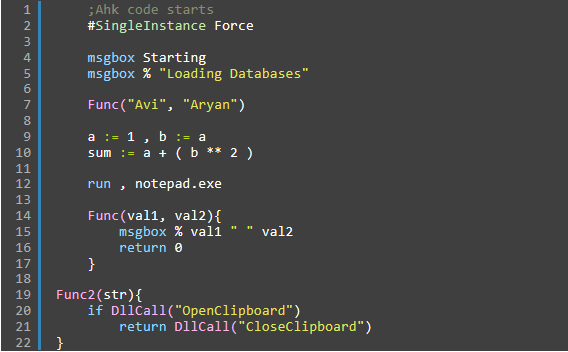
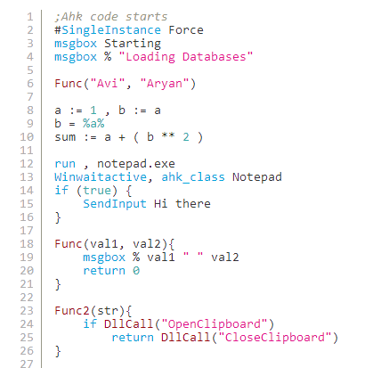

## AutoHotkey [Syntax Highlighter](http://alexgorbatchev.com/SyntaxHighlighter/) Brush with Zenburn and GitHub themes
  
> This project (the **autohotkey** part) is deprecated. I recommend trying [lightAHK](https://github.com/aviaryan/lightAHK)
  
  
**Note** - The themes can be used with any brush (programming language)  
Thanks to **[mjneish](http://users.on.net/~mjneish)** who first provided syntax brush for Autohotkey.  
  
  
#### Screenshots
##### Zenburn
See [Web preview](https://rawgit.com/aviaryan/highlighter-ahk-zenburn/master/Test.html)  

  

##### GitHub
See [Web preview](https://rawgit.com/aviaryan/highlighter-ahk-zenburn/master/Test-Bonus-GitHub.html)  

  

#### Using
* See the **[Test.html](Test.html)** file source to get started and start using the higlighter for your projects.
* Take a look at [SyntaxHighlighter](http://alexgorbatchev.com/SyntaxHighlighter/) site for more details.
  
  
#### Changelog
5/07/2014  
- Standardized the color schemes, now the ahk brush will get highlighted perfectly with all other brushes
  
30/06/2014  
- Fixed bug with number highlighting  
  
29/06/2014  
- Added [Github](http://www.github.com) theme.